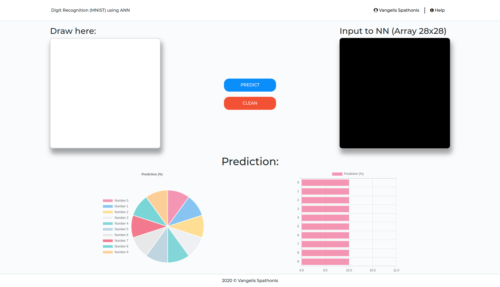
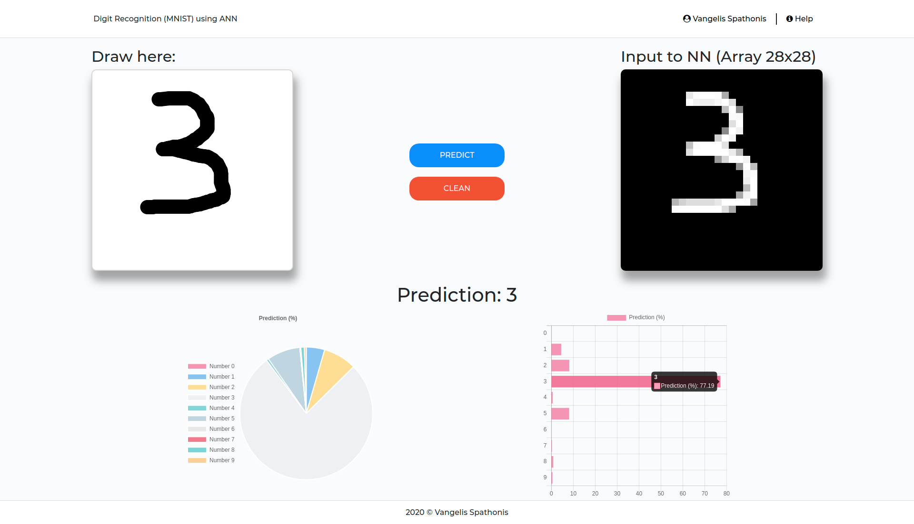
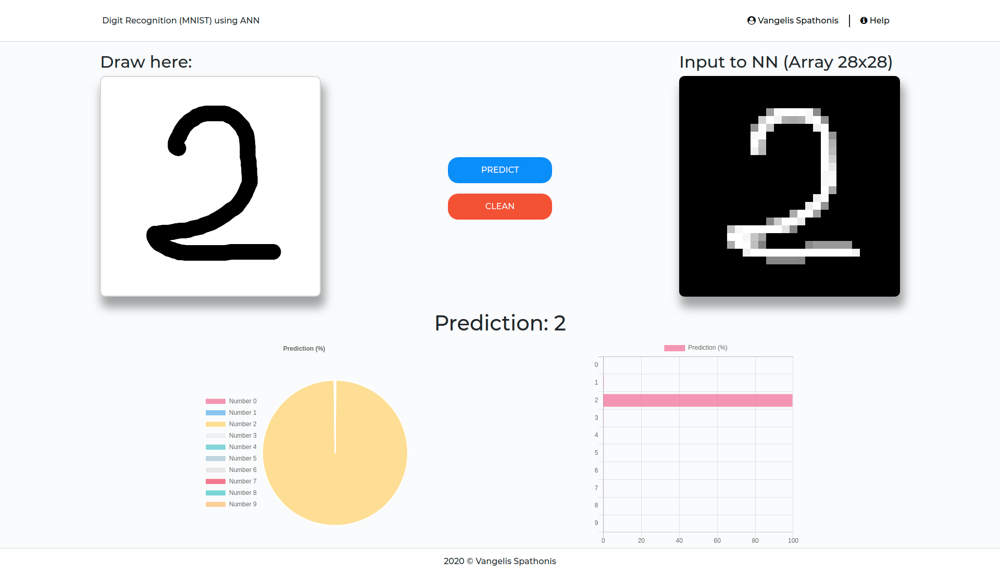

# Digit-Recognition-MNIST-ANN
A Fun Machine Learning Projects during the COVID-19 outbreak.

## Online
https://digit-recognition-mnist-ann.netlify.com/

## Description
In this project, we train our own ANN with one hidden layer using backpropagation algorithm on MNIST dataset which later can help our machine to identify a given numeric digit.

## Information
Information and documentation of the dataset can be found on: http://yann.lecun.com/exdb/mnist/

## Technologies
Backend with Python Flask (trying approaching MVC design pattern)  
Frontend with Angular 9  
Keras

## ANN model
With 3 layers, 2 with 64 neurons and activation function = relu and  1 layer with 10 neurons with activation function= softmax

## Examples
1)

2)

3)

